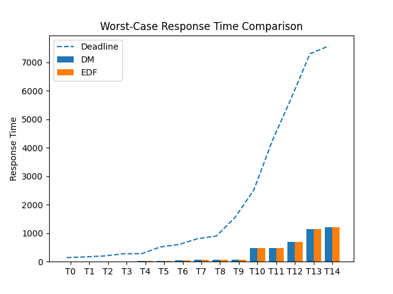
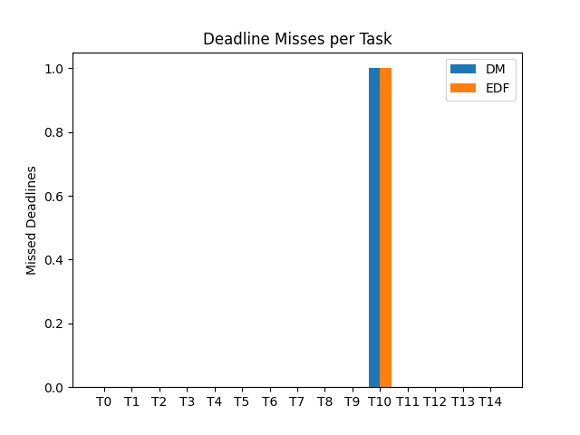
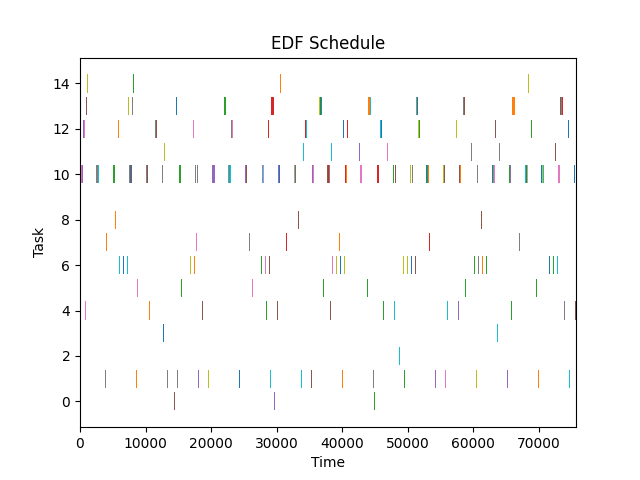
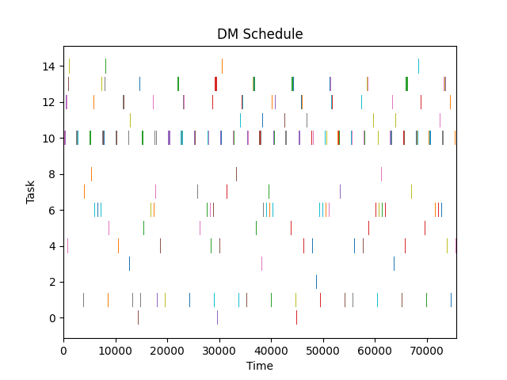

# Group 14 - Mini-Project-1
Mini Project 1 for the Distibuted Real-Time Systems course (02225) at DTU.

## Notation (Buttazzo Chapter 4)

```
Γ       : Task set {τ_1, ..., τ_n}
τ_i     : Periodic task
C_i     : Worst-Case Execution Time (WCET)
T_i     : Period
D_i     : Relative deadline (C_i ≤ D_i ≤ T_i)
Φ_i     : Phase (release time of first instance)
H       : Hyperperiod = lcm(T_1, ..., T_n)
U       : Processor utilization = Σ C_i / T_i
R_i     : Worst-case response time of τ_i
τ_{i,j} : j-th instance (job) of τ_i
r_{i,j} : Release time of τ_{i,j}
d_{i,j} : Absolute deadline = r_{i,j} + D_i
f_{i,j} : Finish time of τ_{i,j}
R_{i,j} : Response time = f_{i,j} - r_{i,j}
U_i     : Utilization Factor
```

---
## Modeling Specifications

### Task Model
Represents a periodic real-time task from a task set. This tasks will go under the assumptions of:

+ `A1`: The instances of a periodic task are regularly activated at a constant rate. The interval. Ti between two consecutive activations is the period of the task.
+ `A2`: All instances of a periodic task have the same worst-case execution time.
+ `A3 (soft)`: All instances of a periodic task have the same relative deadline . Di, which
is equal to the period. Ti.
+ `A4`: All tasks in . 𝚪 are independent; that is, there are no precedence relations and
no resource constraints.

## Running Examples
### Models Commands:

+ To see how the `task` model work 
```bash
python runs/example_task.py
```

+ To see how the `taskset` model work, for analysis run this command. 
> Note: the examples need to be loaded in the `example` folder
```bash
python runs/example_taskset.py --csv taskset-0.csv
```

## Running the Simulator
The main simulation can be executed using:
```bash
python main.py --taskset examples/taskset-0.csv
```

---
## Repo structure
The repository is organized into modular components separating the scheduling models, simulation engine, analysis utilities, and experiment artifacts.
```text
mini-project-1/
│
├── analysis/
│   Plotting and post-processing utilities for simulation results.
│   ├── __init__.py
│   │   Marks the folder as a Python package.
│   └── plots.py
│       Matplotlib-based plotting functions for response times, deadline misses,
│       and schedule visualizations.
│
├── examples/
│   Example task sets used for running and testing simulations.
│   └── taskset-0.csv
│       Sample periodic task set in CSV format.
│
├── figures/
│   Generated figures produced by the plotting utilities.
│   ├── deadline_misses.png
│   ├── dm_schedule.png
│   ├── edf_schedule.png
│   └── response_times.png
│
├── models/
│   Data models used by the scheduler and simulator.
│   ├── scheduling/
│   │   Core scheduling entities and abstractions.
│   │   ├── __pycache__/
│   │   ├── job.py
│   │   │   Defines the job model used during simulation.
│   │   ├── task.py
│   │   │   Defines the periodic task abstraction.
│   │   └── taskset.py
│   │       Container and helper methods for task sets Γ.
│   │
│   └── simulation/
│       Data structures used by the event-driven simulator.
│       ├── __pycache__/
│       └── event.py
│           Defines simulation events such as arrivals, completions, and deadlines.
│
├── output/
│   Folder for experiment outputs, generated datasets, or exported results.
│
├── runs/
│   Small standalone example scripts used to test individual components.
│
├── simulation/
│   Core event-driven simulation engine implementing the scheduling logic.
│   ├── __pycache__/
│   └── engine.py
│       Main simulator for running DM, EDF, and related scheduling experiments.
│
├── venv/
│   Older or alternative virtual environment folder.
│   This should also not be committed to version control.
│
├── .gitignore
│   Specifies files and folders that Git should ignore.
│
├── main.py
│   Main entry point of the project. Loads a task set, runs simulations,
│   compares results, and triggers plot generation.
│
├── README.md
│   Project documentation, usage instructions, and repository overview.
│
├── requirements.txt
│   Python dependencies required to run the project.
│
├── result.txt
│   Example textual output from simulation runs.
│
└── task-sets.zip
    Collection of additional task sets used for experiments.
```

## Graphs produced
### Response Time Comparison
Shows WCRT and compares DM vs EDF.
- The dashed line represents the **task deadline**.
- This graph helps visually compare how **Deadline Monotonic (DM)** and **Earliest Deadline First (EDF)** perform for each task.



### Deadline Miss
Displays the **number of missed deadlines per task** for each scheduling algorithm.



## Schedule Visualizations (Gantt Charts)
The following graphs show the **execution timeline of tasks on the processor**.  
Each horizontal bar represents a time interval where a task is executing.

The **Earliest Deadline First (EDF)** scheduler dynamically assigns priority based on the **closest absolute deadline** of each job. At every scheduling point, the job with the earliest deadline is selected for execution:


The **Deadline Monotonic (DM)** scheduler is a **fixed-priority algorithm** where tasks with **shorter relative deadlines** receive higher priority. Unlike EDF, priorities are static and determined before execution begins:
